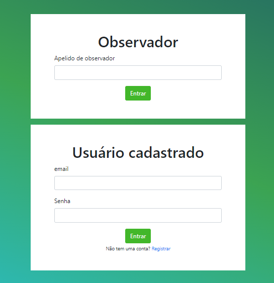
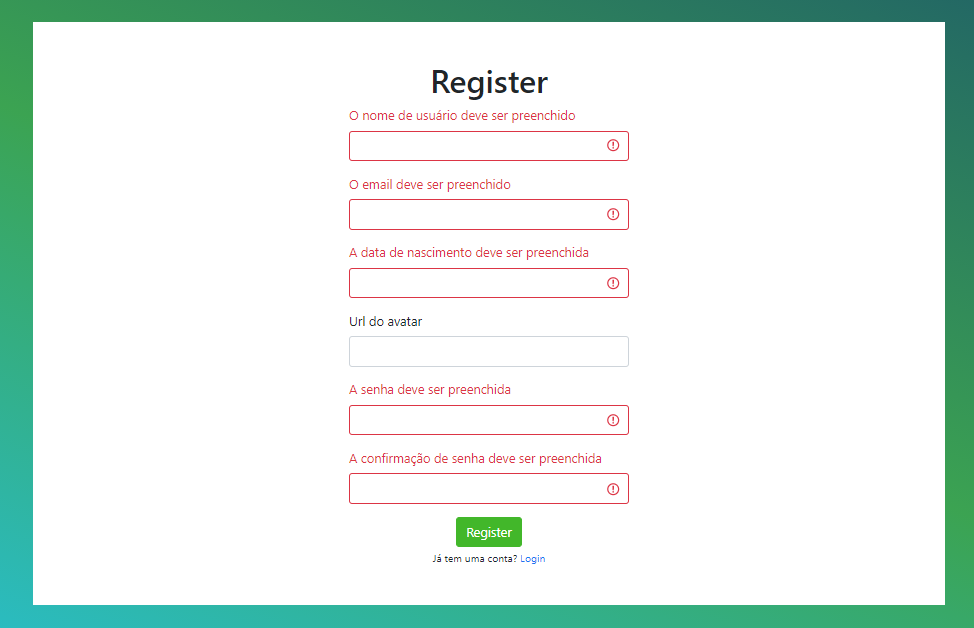

# 🔥 FunChat

Seja bem vindo ao FumChat!

O FunChat é uma aplicação de salas de bate-papo simples e direta ao ponto. Você não precisa se cadastrar para ver as conversas nem para criar novas salas. Basta fornecer um apelido de observador.


Por meio de subscriptios o sistema atualiza a lista de participantes assim como as mensagens enviadas em cada sala 


 Mas apenas usuários logados conseguem mandar mensagens.


Os tokens de validação não expiram. Uma vez logado você pode sair e voltar tranquilamente.






O formulário de login e de registro possuem validação para confirmar o preenchimento dos dados.


As salas são criadas dinamicamente, basta procurar por uma ou digitar no caminho o nome desejado “localhost/chat/” para criar uma nova.

## 💻 Configurando o projeto

### API - Com Docker
Clone o projeto
```
git clone https://github.com/antoniocarlos/funchat.git
```

Acesse a pasta server
```
cd server
```

Copie e renomeando o arquivo de variáveis de ambiente
```
cp .env_example .env
```

Executando o docker-compose
```
docker-compose up --build
```

Executando as migrations
```
docker exec -it server_fun-chat-api_1 sh -c "npm run migrate"
```

Executando o seed
```
docker exec -it server_fun-chat-api_1 sh -c "npm run seed"
```

### Cliente - com Yarn

Exige Node 16.13 ou maior

Na pasta do cliente
```
yarn
```

Rodando o cliente
```
yarn start
```

## 🤖 Tecnologias usadas

apollo/client/server

graphql<br>
subscriptions-transport-ws<br>
jest<br>
react-bootstrap<br>
node-sass<br>
bcryptjs<br>
jsonwebtoken<br>
mysql2<br>
sequelize<br>


## 📚 Documentação da API:

O sistema é servido por uma API graphQL baseada em Apollo server

###Types

```javascript
type User {
  userName: String!
  email: String!
  birthDate: String!
  createdAt: String!
  updatedAt: String!
  token: String
  imageUrl: String
}

type Observer {
  observerName: String!
  createdAt: String!
  updatedAt: String!
  token: String
}

type ChatRoom {
  id: String!
  name: String!
  messages: [Message]
  users: [User]
  observers: [Observer]
  createdAt: String!
}

type Message {
  uuid: String!
  userId: String!
  sender: String!
  content: String!
  chatRoomId: String!
  createdAt: String!
}

type Audience {
  chatRoomIdEnter: String!
  chatRoomIdOut: String!
  user: User
  observer: Observer
}
```

###Mutations

Cria um usuário

```javascript
type Mutation {
  register(
    userName: String!
    email: String!
    birthDate: String!
    imageUrl: String
    password: String!
    confirmPassword: String!
  ): User!
}
```
Cria uma nova mensagem OBS: Rota aoutenticada

```javascript
type Mutation {
  createMessage(
    sender: String!
    content: String!
    chatRoomName: String!
  ): Message!
}
```

Cria um novo chatRoom

```javascript
type Mutation {
  createChatRoom(name: String!): ChatRoom!
}
```

Retira um usuário ou observador de um chatRoom OBS: Rota aoutenticada

```javascript
type Mutation {
  checkoutChatRoom(chatRoom: String!): Audience!
}
```

###Querys

Lista os usuários cadastrados

```javascript
type Query {
  getUsers: [User]
}
```
Loga com um usuário cadastrado e gera um token

```javascript
type Query {
  login(email: String!, password: String!): User
}
```

Lista os observadores

```javascript
type Query {
  getObservers: [Observer]
}
```

Loga com um observador e gera um token

```javascript
type Query {
  observerLogin(observerName: String!): Observer
}
```

Desloga um observador OBS: Rota aoutenticada

```javascript
type Query {
  observerLogoff(observerName: String!): Observer
}
```

Lista todas as mensagens

```javascript
type Query {
  getMessages: [Message]
}
```

Lista todos os chatRooms

```javascript
type Query {
  getChatRooms: [ChatRoom]
}
```

Devolve todos os dados presentes em um chatRoom e entra com o usuário no chatRoom OBS: Rota aoutenticada

```javascript
type Query {
  getChatRoom(chatRoom: String!): ChatRoom
}
```

Subscription chamada toda vez que uma nova mensagem é enviada OBS: Rota aoutenticada

```javascript
type Subscription {
  newMessage: Message!
}
```

Subscription chamada toda vez que um usuário ou observador muda de chatRoom OBS: Rota aoutenticada

```javascript
type Subscription {
  updateAudience: Audience!
}
```